> 样本空间：
>
> - 样本空间是「试验结果」的集合。
>
> 事件：
>
> - 事件是样本空间的「子集」，概率是「事件」的概率。
>
> 什么是概率：
>
> - 是我们对某件事情的「信念」。
>
> 什么是推断：
>
> - 直观来说，如果一个人很高兴，那么他很有可能是遇到了什么好事。
>
> 什么是独立：
>
> - 知道了一件事的情况，不能对我们预测另一件事提供任何帮助，那么这两件事是独立的。
>
> 全概率公式：
>
> - 要计算事件 $A$ 发生的概率，可以将样本空间划分为 $B_1,\ B_2,\ \cdots$，然后分别考虑在 $B_i$ 发生的条件下事件 $A$ 发生的概率。
>
> 概率的乘法规则是一定成立的：
> $$
> P(A\cap B) = P(A) \cdot P(B|A) = P(B) \cdot P(A|B)
> $$

[toc]

### 事件和样本空间

**样本空间**：样本空间就是「**试验**」结果的集合。集合元素就是「**试验可能的结果**」。

**事件**：样本空间的子集称为「**事件**」。

注：我们在说「概率」时，说的是「样本空间」的「**子集**」的概率，并不是说「样本空间」中「**元素**」的概率。

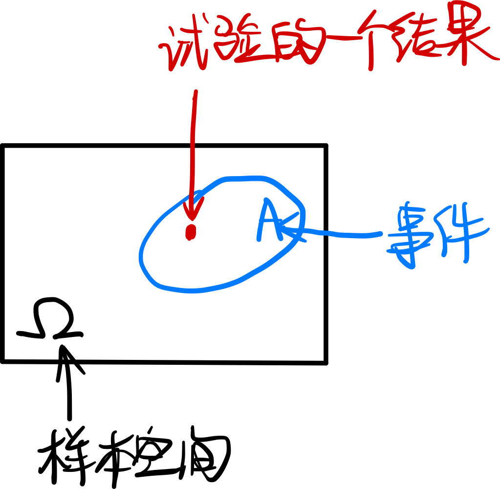

### 条件概率

#### 1、什么是条件概率

条件概率的直观认识：

概率是我们的信念「faith」，一件事情的概率，会随着与之相关的事情的发生而改变。

>  例如，下图中事件 A 和事件 B 位于同一个样本空间中：
>
>  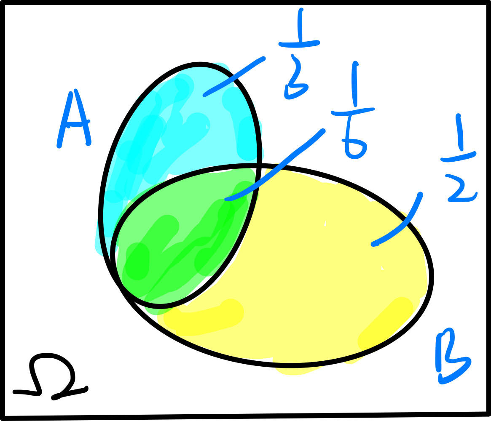
>
>  - 如果不知道事件 B 是否发生，那么事件 A 发生的概率是 $\frac{2}{3}$ 
>  - 如果已经知道事件 B 发生了，那么事件 A 发生的概率是 $\frac{1}{4}$ 

条件概率可以看作是一个新的概率空间：

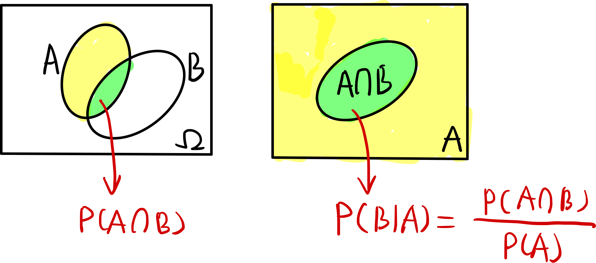

#### 2、雷达检测的例子

概率树可以很清晰地表示出条件概率。

例如：以下条件：

- 天空有飞机飞过的概率是 $P(A) = 0.05$ 
- 如果有飞机飞过，雷达正确指示的概率是 $P(B|A)=0.99$  
- 如果没有飞机飞过，雷达显示有物体飞过的概率是 $P(B|A^c)=0.10$ 

用概率树表示，即为：

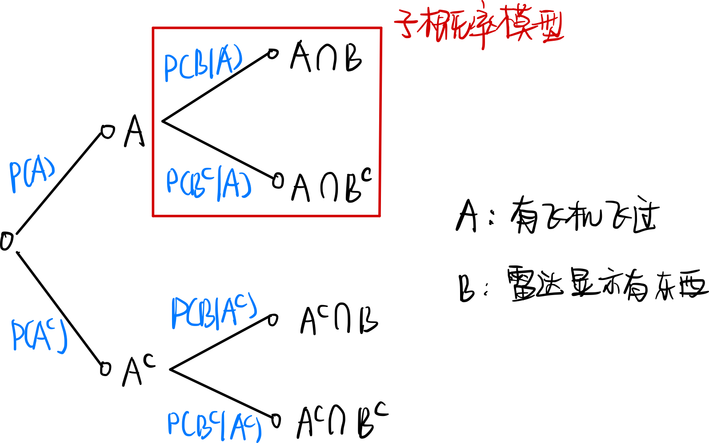

概率树的每个树杈，都是一个小的概率模型；多个小的概率模型，组成了整个的概率模型。

现在要计算以下事件发生的概率：

**事件 $A\cap B$：飞机飞过，且雷达准确检测出** 
$$
\begin{array}{rl}
	P(A\cap B) & = P(A) \cdot P(B|A) \\
	           & = 0.0495
\end{array}
$$
**事件 $B$：雷达测出了一些东西** 

这个事件可以分为两个不相交的事件：

1. 飞机飞过，且雷达测出了一些东西；
2. 飞机没飞过，但雷达测出了一些东西

$$
\begin{array}{rl}
	P(B) & = P(A\cap B) + P(A^c \cap B) \\
         & = P(A) \cdot P(B|A) + P(A^c) \cdot P(B|A^c) \\
         & = 0.1445
\end{array}
$$

**事件 $A|B$：雷达已经测出了一些东西，飞机有飞过**
$$
\begin{array}{rl}
	P(A|B) & = \frac{P(A\cap B)}{P(B)} \\
	       & \approx 0.3426
\end{array}
$$

对于 $P(A)$ 和 $P(A|B)$：

- 在得到雷达检测结果之前，我们认为飞机飞过的概率是 $0.05$ 
- 在得到雷达检测结果之后，我们认为飞机飞过的概率是 $0.3426$ 

可见，==我们对于事件发生的「faith」会随着其他相关事件的发生而改变==。  

**继续进行检测**：

考虑继续进行检测，那么现在飞机飞过的概率就可以修正为：
$$
P(A') = P(A|B) = 0.3426
$$
再次检测，雷达仍然测出了东西，那么飞机飞过的概率为：
$$
\begin{array}{rl}
	P(A' | B) & = \frac{P(A' \cap B)}{P(B)} \\
	          & = \frac{P(A') \cdot P(B|A')}{P(A') \cdot P(B|A') + P(A^c{}') \cdot P(B|A^c{}')} \\
	          & \approx 0.8377
\end{array}
$$

> 这里的 $P(B|A')$ 仅仅和雷达自身的属性有关，也就是雷达的精度。

这里可以知道，如果雷达两次检测都测出了有东西飞过，那么飞机飞过的概率就大幅提升了。我们的会非常详细飞机确实飞过，这很符合「直觉」。

#### 3、条件概率的一般情况

对于更一般的情形：

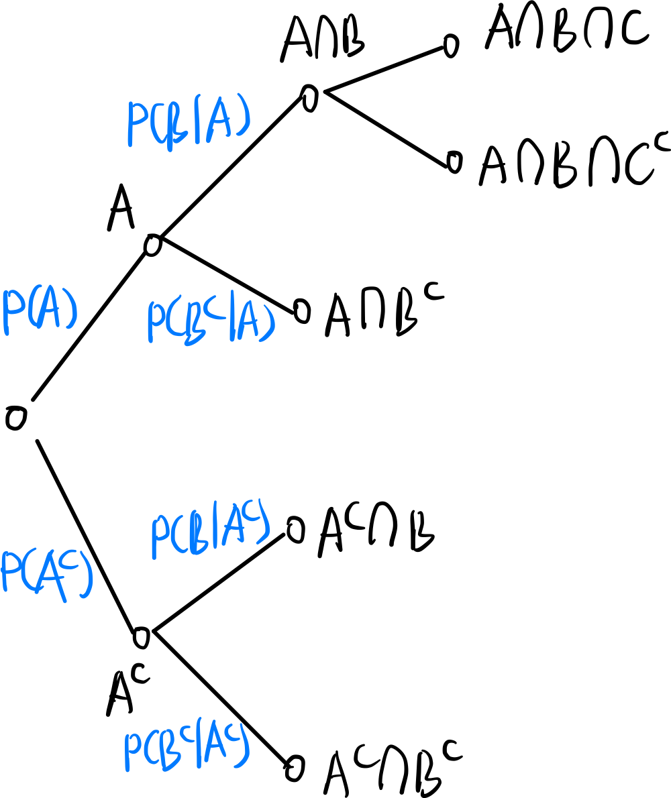

**计算整个概率模型下某个分支的概率**：

只要将路径上的条件概率乘起来即可：
$$
\begin{array}{rl}
	P(A \cap B \cap C) & = P(A \cap B) \cdot P(C | A \cap B) \\
	                   & = P(A) \cdot P(B|A) \cdot P(C|A\cap B)
\end{array}
$$

> ==**乘积规律是很符合直觉的**==：
>
> 事件 $A, B$ 都发生的概率，相当于先有事件 $A$ 发生，然后在事件 $A$ 发生的情形下事件 $B$ 也发生。

**计算某个事件发生的概率，例如 $P(B)$**：

那就需要考虑所有的子情况，然后对每种情况使用相应的条件概率计算：

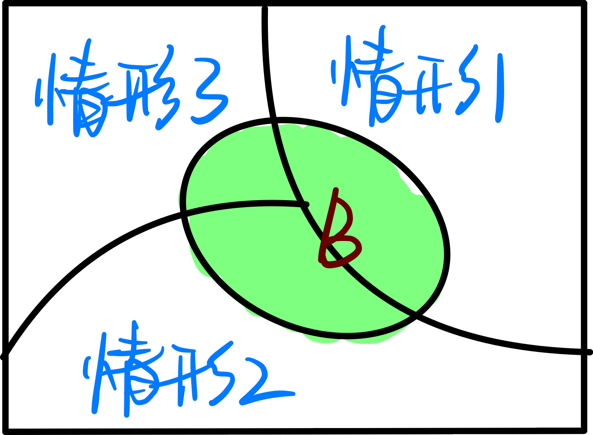
$$
P(B) = P(A) \cdot P(B|A) + P(A^c) \cdot P(B|A^c)
$$
**先验与后验**：

我们求解了三种为题：

- $P(A\cap B)$：两个事件同时发生
- $P(B)$：无条件概率
- $P(A|B)$：根据先验概率，来推断事件发生的概率。

这实际上涉及到一个哲学问题：实践是否能够反过来改变认知。

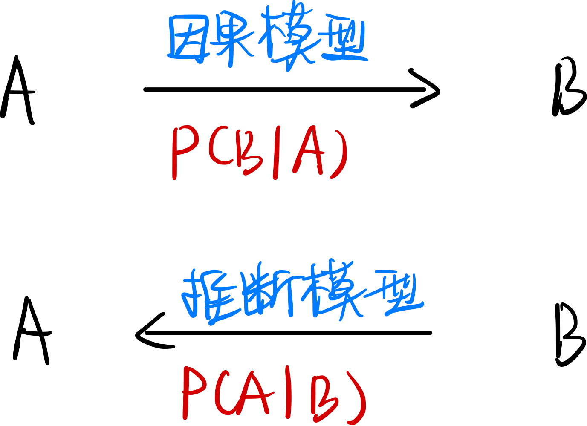

### 独立

#### 1、独立的事件

考虑连续投掷两次硬币的实验：

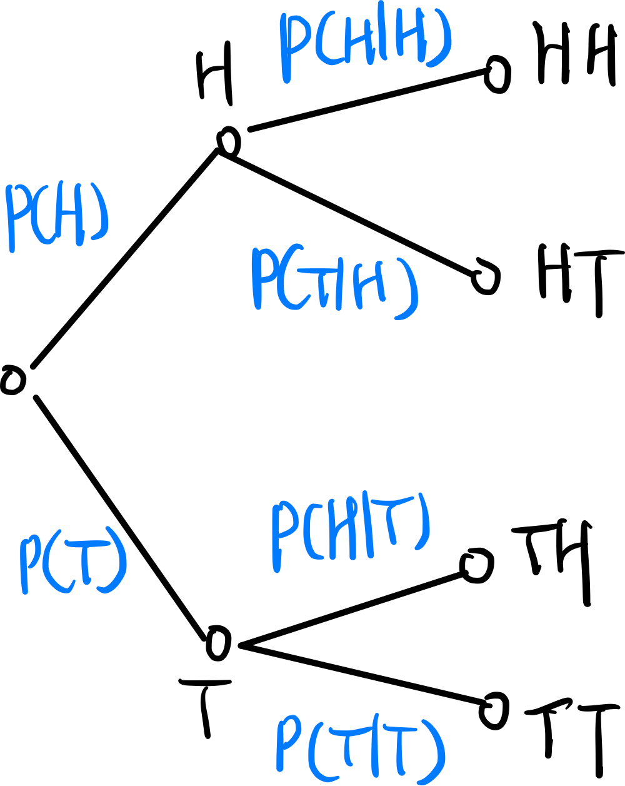

以下事件的概率为：

1. 第一次正面，第二次反面：$P(HT) = p(1-p)$ 
2. 有一次正面：$P(1H) = 2(1-p) * p$ 
3. 已经有一次正面，那么推断第一次是正面的概率：$P(1st H|1H) = 1/2$ 

> ==预测和推断==：
>
> - 预测的例子：已知第一次投掷结果，第二次是正面的概率
> - 推断的例子：已知两次结果情况，那么第一次是正面的概率

**什么叫独立**：

一件事情是否发生，不会影响对后续事件的预测（不会改变「faith，belief」）。如果 $A, B$ 相互独立，那么有：
$$
P(B) = P(B|A)
$$
由于乘积规律：$P(A\cap B) = P(A) \cdot P(B|A)$，因此有：
$$
P(A\cap B) = P(A) \cdot P(B)
$$

#### 2、条件独立

在原始的概率模型中独立，并不意味着在新的概率模型中两个事件仍然独立。例如：

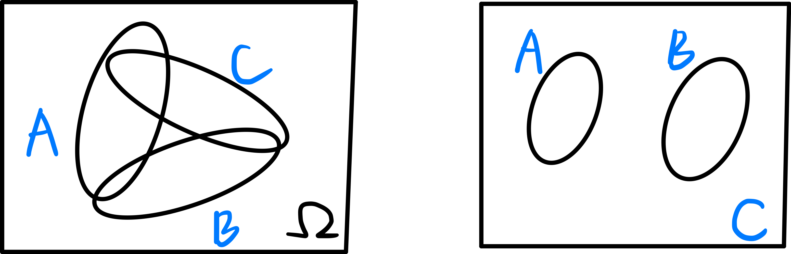

上图，在整个样本空间 $\Omega$ 中，$A, B$ 是相互独立的。如果已知 $C$ 发生了，那么事件 $A\cap C$ 和 $B\cap C$ 是否是独立的？

不是，在 $A\cap C$ 发生时，$B\cap C$ 一定不会发生。

#### 3、例子：不均匀硬币

现有两个硬币，硬币 $A$ 正面朝上的概率是 0.9，硬币 $B$ 正面朝上的概率是 0.2。

分别投掷两次，对应的概率树是：

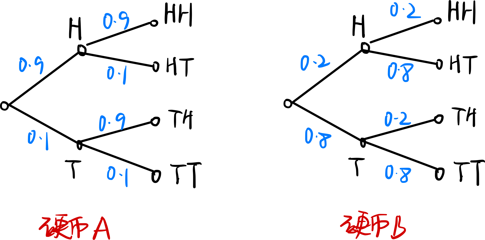

如果随机选择一枚硬币，然后投掷多次，则对应的概率树是：

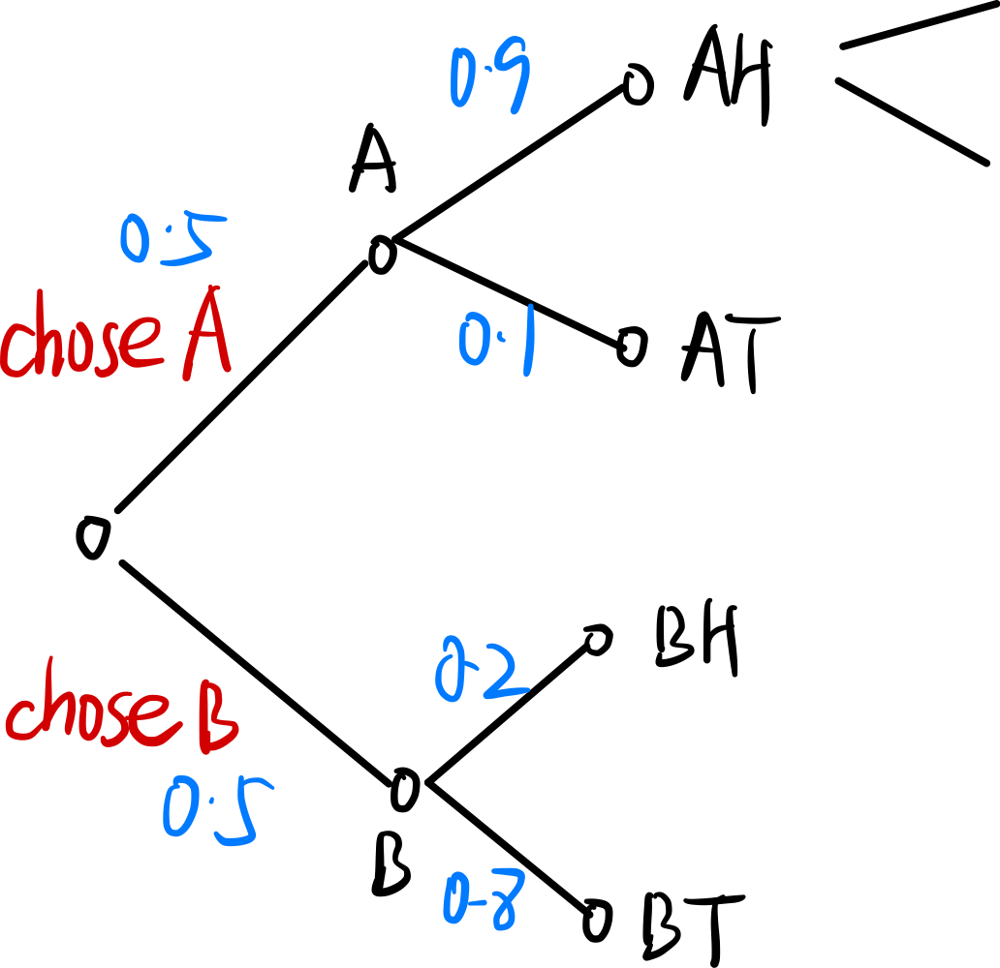

考察以下事件的概率：

**第 11 次投掷正面朝上的概率是**：
$$
P = P(A\cap H) + P(B\cap H) = 0.55
$$
**如果已知前 10 次投掷全是正面朝上，第 11 次正面朝上的概率**：

> 前 10 次全是正面朝上，那么我们选择的硬币很有可能是 $A$，因此第 11 次正面朝上的概率就很大。

$$
\begin{array}{rl}
	P(11st\ H|10\times H) & = P(11st\ H | A) \cdot P(A | 10 \times H) \\
	                      & + P(11st\ H | B) \cdot P(B | 10 \times H) \\
	                      & \approx 0.9
\end{array}
$$

在知道了前 10 次的投掷结果后，为什么会影响对 11 次的投掷结果的预测？

因为两者通过「选择哪一枚硬币」这个事件联系了起来，两者并不是独立的。

#### 4、事件独立的定义

如果三个事件独立，那么要求：
$$
\begin{array}{l}
	P(A_1 \cap A_2 \cap A_3) = P(A_1) \cdot P(A_2) \cdot P(A_3) \\
	P(A_1 \cap A_2) = P(A_1) \cdot P(A_2) \\
	P(A_1 \cap A_3) = P(A_1) \cdot P(A_3) \\
	P(A_2 \cap A_3) = P(A_2) \cdot P(A_3) \\
\end{array}
$$
第一个条件看起来是多余的，实际上并不是。通过下面这个例子来解释说明：

> 投掷两次硬币：
>
> 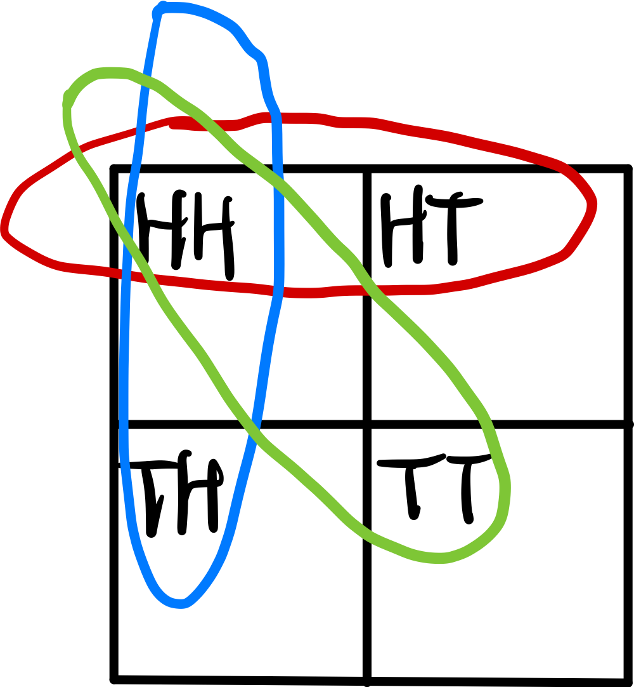
>
> 以下事件的概率为：
>
> - 事件 $A$ 表示第一次是正面：$P(A) = 1/2$ 
> - 事件 $B$ 表示第二次是正面：$P(B) = 1/2$ 
> - 事件 $C$ 表示两次结果相同：$P(C) = 1/2$ 
>
> 三个事件是两两独立的。
>
> 如果已知事件 $A\cap B$ 发生了，那么事件 $C$ 发生的概率是多少？
> $$
> P(C | A \cap B) = 1
> $$
> 对比一下，可以看出来，事件 $C$ 发生的条件概率并不等于无条件概率，因此 $A,B,C$ 整体不是独立的。

### 计数

#### 1、组合数的符号

这个符号的意义：$C_n^k$ ，表示从 $n$ 个元素中取 $k$ 个，共有多少种取法。

#### 2、$\sum_{k=0}^{n} C_n^k$  是多少

首先看这个表达式的意义：它可以表示 $n$ 个元素的集合共有多少个子集。

从下图可以看出，共有 $2^n$ 个子集：

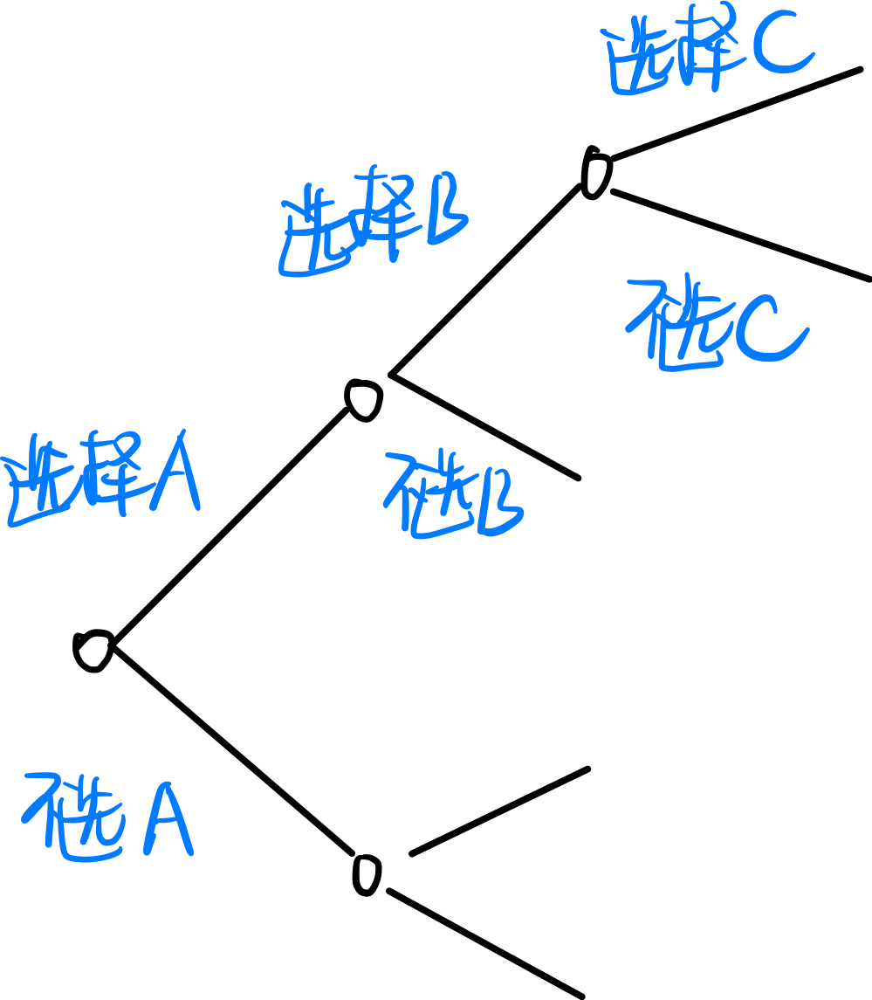

因此：
$$
\sum_{k=0}^k = 2^n
$$

#### 3、二项式概率

典型的二项式概率：扔 $n$ 次硬币，其中 $k$ 次正面朝上的概率：
$$
P(k) = C_n^k\ p^k\ (1-p)^{n-k}
$$
根据概率的含义（样本空间的概率总和是 $1$），可以得到一下表达式的值：
$$
\sum_{k=0}^n C_n^k\ p^k\ (1-p)^{n-k} = 1
$$

#### 4、前三次硬币是正面

抛硬币的实验，如何理解「前三次全是正面」这个事件？

可以通过下图来理解：

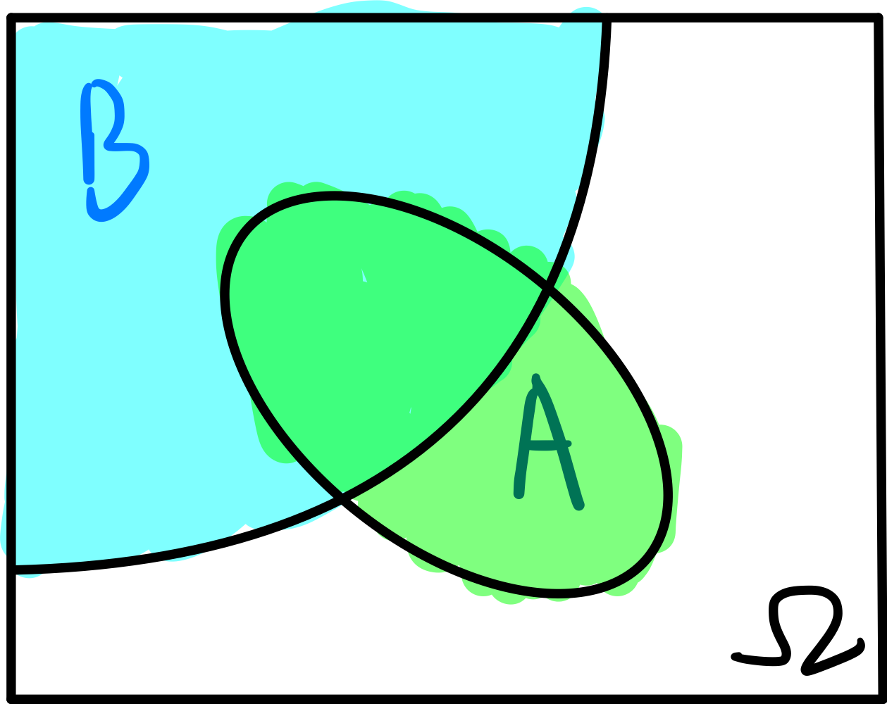

其中：

- 事件 $B$ 表示掷三次硬币的所有结果
- 事件 $A$ 表示前三次全是正面

因此，「前三次全是正面」的概率如下计算：