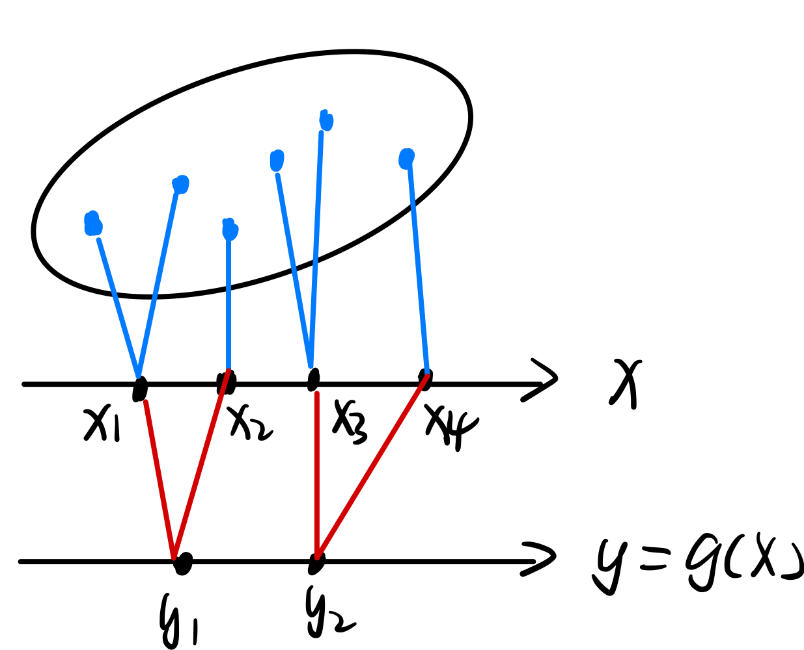
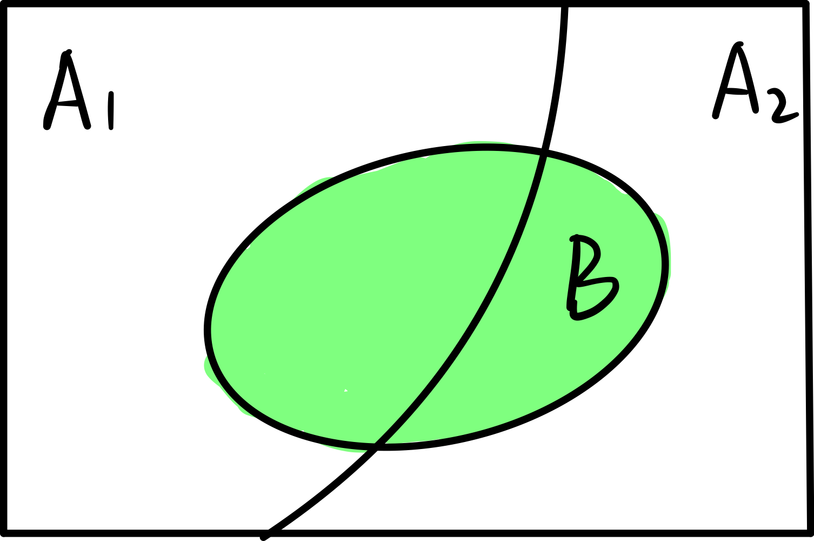
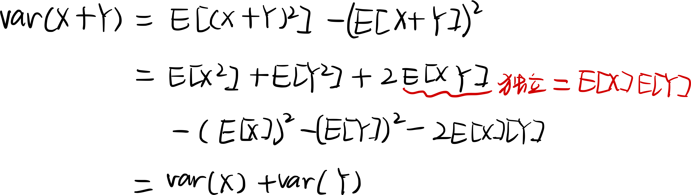

> 独立就意味着：
>
> - $f_{X|Y}(x|y) = f_X(x)$，从而有：$f_{X,\ Y}(x,\ y) = f_X(x) \cdot f_Y(y)$.
> - $E(XY) =E(X)E(Y)$  
> - $var(X+Y) = var(X) + var(Y)$ 

[toc]

### 随机变量的期望

#### 1、期望的计算

随机变量的期望定义如下：
$$
E[X] = \sum_x x\  p_X(x)
$$
如果有两个随机变量 $X,\ Y$ ，关系如下：

求 $Y$ 的期望。

有以下两种计算方法：

- 如果已知 $Y$ 的 PMF，那么：

$$
E[Y] = \sum_y y\ p_Y(y)
$$

- 如果只知道 $X$ 的 PMF，那么：

$$
E[Y] = \sum_x g(x) \ p_X(x)
$$

>注：期望的函数并不等于函数的期望：
>$$
>E[g(X)] \ne g(E[X])
>$$

#### 2、期望的性质

线性的性质：
$$
E[\alpha X + \beta] = \alpha E[X] + \beta
$$

#### 3、随机变量函数的期望

随机变量函数的均值：
$$
E[g(X,\ Y)] = \sum_x \sum_y g(x,\ y) \cdot p_{X,\ Y}(x,\ y)
$$
多个随机变量的线性组合，其均值为：（非常简单，不证明）
$$
E[\alpha X + \beta Y] = \alpha E[X] + \beta E[Y]
$$
如果两个随机变量**独立**，那么两者乘积的均值为：[^2]
$$
E[XY] = E[X] \cdot E[Y]
$$
如果 $X,\ Y$ 相互独立，那么相关的函数 $g(X),\ h(Y)$ 也应当独立，类似的有：
$$
E[g(X)\cdot h(Y)] = E[g(X)] \cdot E[h(Y)]
$$

### 随机变量的方差 

#### 1、方差的定义

方差定义[^1]：
$$
var(X) = E[(X - E[X])^2] = E[X^2] - (E[X])^2
$$
方差的性质：
$$
var(\alpha X + \beta) = \alpha^2 var(X)
$$

#### 2、随机变量函数的方差

如果随机变量 $X,\ Y$ **相互独立**，那么两者之和的方差为[^3]：
$$
var(X+Y) = var(X) + var(Y)
$$
利用方差的性质，可以得到两者线性组合的方差：
$$
var(\alpha X + \beta Y) = \alpha^2 \ var(X) + \beta^2 \ var(Y)
$$

### 用条件概率计算期望

#### 1、条件 PMF

条件 PMF 的定义为：
$$
P_{X|A}(x) = P(X = x | A)
$$
如下图所示：

条件 PMF 的期望：
$$
E[X|A] = \sum_x x\ P_{X|A}(x)
$$
给定条件下随机变量函数的期望：
$$
E[g(x)|A] = \sum_x g(x)\ p_{X|A}(x)
$$

#### 2、全概率公式应用到期望计算

回忆全概率公式：
$$
P(B) = P(A_1)P(B|A_1) + P(A_2)P(B|A_2)
$$

类似的，PMF 也可以通过这个方法来计算：
$$
P_X(x) = P(A_1)p_{X|A_1}(x) + P(A_2)p_{X|A_2}(x)
$$
期望也可以用这个方法来计算：
$$
\begin{array}{rl}
	E[X] & = \sum_x [P(A_1) \cdot x \cdot p_{X|A_1}(x) + P(A_2) \cdot x \cdot p_{X|A_2}(x)] \\
	     & = P(A_1) \cdot E[X|A_1] + P(A_2) \cdot E[X|A_2]
\end{array}
$$

#### 3、几何随机变量的期望

几何随机变量对应的试验是：

> 抛硬币，直到第 $k$ 次才出现正面朝上，将次数记为 $X$ 

PMF 为：
$$
P_X(k) = (1-p)^{k-1} p
$$
如何计算这个随机变量的期望？如果直接计算会非常困难：
$$
E[X] = \sum_x x \cdot (1-p)^{x - 1}p
$$
可以利用上面的全概率形式计算：
$$
E[X] = P(A_1)\ E[X|A_1] + P(A_2)\ E[X|A_2]
$$
其中：

- $A_1$ 表示第一次就正面朝上
- $A_2$ 表示第一次反面朝上

因此，上述期望的表达式可以写作：
$$
E[X] = P(X=1)\ E[X|X=1] + P(X>1)\ E[X|X>1]
$$
由于每次投掷是互相独立的，因此第一次得到反面并不会让后续更快地出现正面。即：
$$
E[X] = E[X-1|X>1]
$$
因此：
$$
\begin{array}{rl}
	E[X] & = P(X=1)\ E[X|X=1] + P(X>1)\ E[X|X>1] \\
	     & = p \cdot 1 + (1 - p) \cdot (E[X] + 1)
\end{array}
$$
最终可以解出：
$$
E[X] = \frac{1}{p}
$$
这算是计算期望的一个技巧。

### 使用辅助随机变量计算期望和方差

#### 1、二项分布随机变量的期望和方差

​	符合二项分布的随机变量 $X$，其 PMF 为：$p_X(k) = C_n^k p^k(1-p)^{n-k}$ 

​	想要计算随机变量的均值，用定义计算非常困难，可以借助一个辅助的随机变量来计算。

​	以抛硬币的试验为例：
$$
X_i = 
\left\{
	\begin{array}{cc}
		1 & \text{, 第 i 次是正面} \\
        0 & \text{, 第 i 次是反面}
	\end{array}
\right.
$$
​	随机变量 $X$ 和 $X_i$ 之间有以下关系：
$$
X = \sum_i X_i
$$
​	由于 $X_i$ 的期望很容易计算得到：$E[X_i] = p$ ，因此：
$$
E[X] = \sum_i E[X_i] = np
$$
​	同样，$X_i$ 的方差也很容易计算得到：$var(X_i) = E[X_i{}^2] - (E[X_i])^2=p-p^2$ ，$X_i$ 之间互相独立，因此：
$$
var(X) = \sum_i var(X_i) = n(p-p^2)
$$

#### 2、随机拿帽子试验

有这样一个试验：

> 有 $n$ 个人，他们将各自的帽子放进一个箱子里，然后随机从箱子中取出一顶帽子，将恰好拿到自己帽子的人书记为 $X$ 

求随机变量 $X$ 的均值。

如果直接计算，比较困难，同样可以利用一个辅助的随机变量：
$$
X_i =
\left\{
	\begin{array}{cl}
		1 & \text{, 第 i 个人拿到的是自己的帽子} \\
        0 & \text{, 第 i 个人拿到的不是自己的帽子}
	\end{array}
\right.
$$
随机变量 $X$ 和 $X_i$ 之间有以下关系：
$$
X = \sum_i X_i
$$
根据直觉，很容易得到 $X_i$ 的 PMF：$P(X_i=1) = \frac{1}{n}$ ，因此 $X_i$ 的期望为：$E[X_i] = \frac{1}{n}$ ，随机变量 $X$ 的期望可以由此得到：
$$
E[X] = \sum_i E[X_i] = 1
$$
由于 $X_i$ 之间并不是独立的，因此方差并没有那么容易算出[^4]。

### Ref

[^1]: 方差的计算公式

$$
\begin{array}{rl}
	var(X) & = E[(X - E[X])^2] \\
	       & = \sum_x(x - E[X])^2\ p_X(x) \\
	       & = \sum_x x^2 p_X(x) + (E[X])^2\sum_x p_X(x) - 2E[x]\sum_x x\ p_X(x) \\
	       & = E[x^2] - (E[X])^2
\end{array}
$$

[^2]: 独立随机变量乘积均值的推导

$$
\begin{array}{rl}
	E[XY] & = \sum_x \sum_y xy \cdot p_{X,\ Y}(x,\ y) \\
	      & = \sum_x \sum_y xy \cdot p_X(x) \cdot p_Y(y) \\
	      & = E[X] \cdot E[Y]
\end{array}
$$

[^3]: 独立随机变量之和的方差推导

[^4]: 随机拿帽子试验方差的计算

​	随机变量 $X$ 的方差，按照定义：
$$
var(X) = E[X^2] - (E[X])^2 = E[X^2] - 1
$$
​	$X^2$ 可以分解为：
$$
\begin{array}{rl}
	X^2 & = \sum_i X_i \cdot \sum_i X_i \\
	    & = \sum_i X_i{}^2 + \sum_{i \ne j} X_i \cdot X_j
\end{array}
$$
​	因此，方差为：
$$
var(X) = \sum_i E[X_i{}^2] + \sum_{i\ne j}E[X_i \cdot X_j] - 1
$$
​	其中，$X_i{}^2$ 的方差很容易计算：$E[X_i{}^2] = \frac{1}{n}$  

​	要计算 $X_i\cdot X_j$ 的期望，需要先算出相应的概率：
$$
P(X_1 \cdot X_2 = 1) = P(X_1 = 1) \cdot P(X_2 = 1 | X_1 = 1) = \frac{1}{n} \cdot \frac{1}{n-1}
$$
​	因此，$X_i\cdot X_j$ 的期望为：
$$
E[X_i \cdot E_j] = \frac{1}{n} \cdot \frac{1}{n-1}
$$
​	最后，可以算出 $X$ 的方差：
$$
\begin{array}{rl}
	var(X) & = \sum_i E[X_i{}^2] + \sum_{i\ne j}E[X_i \cdot X_j] - 1 \\
	       & = n \cdot \frac{1}{n} + n(n-1)\cdot \frac{1}{n}\cdot \frac{1}{n-1} -1 \\ 
	       & = 1
\end{array}
$$
