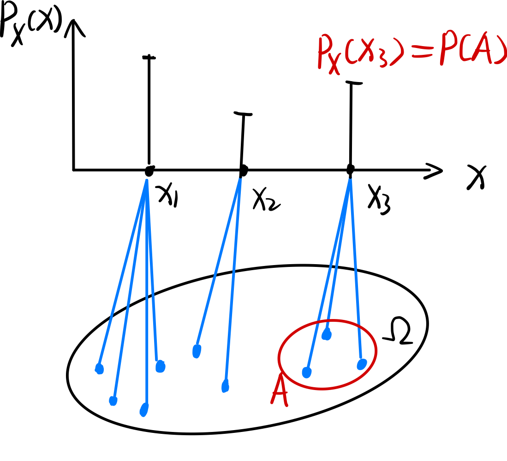
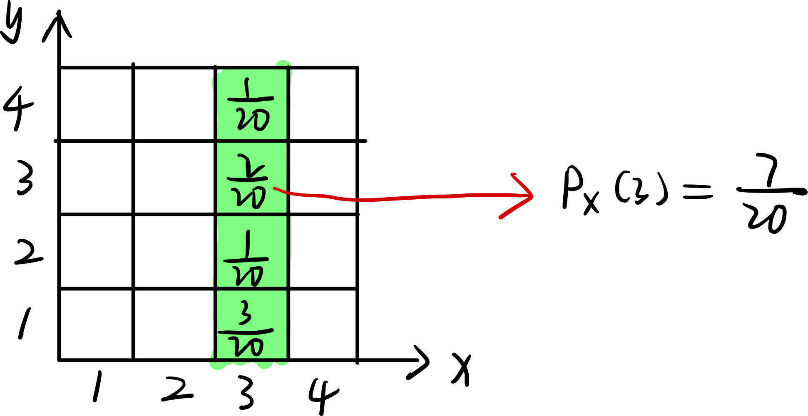
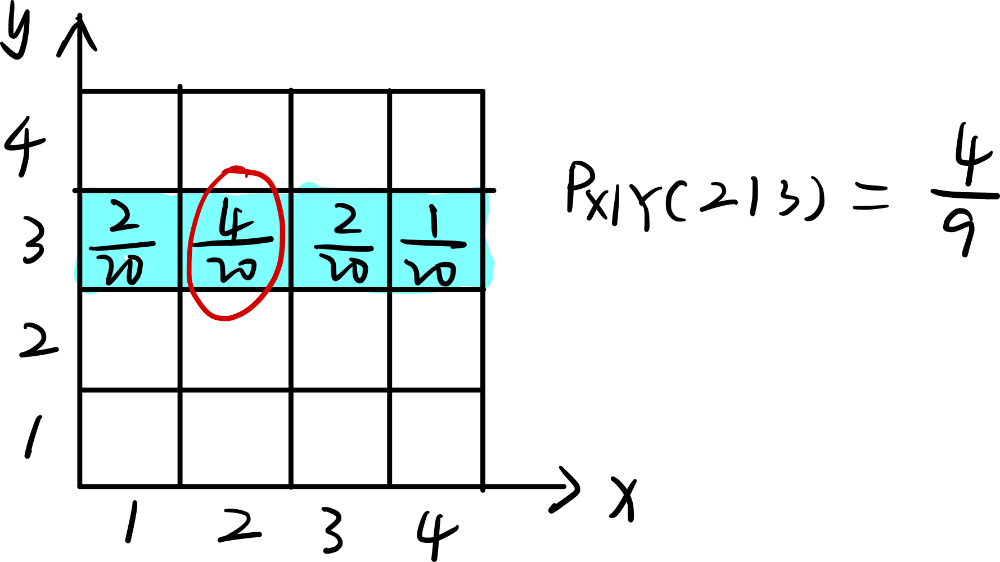
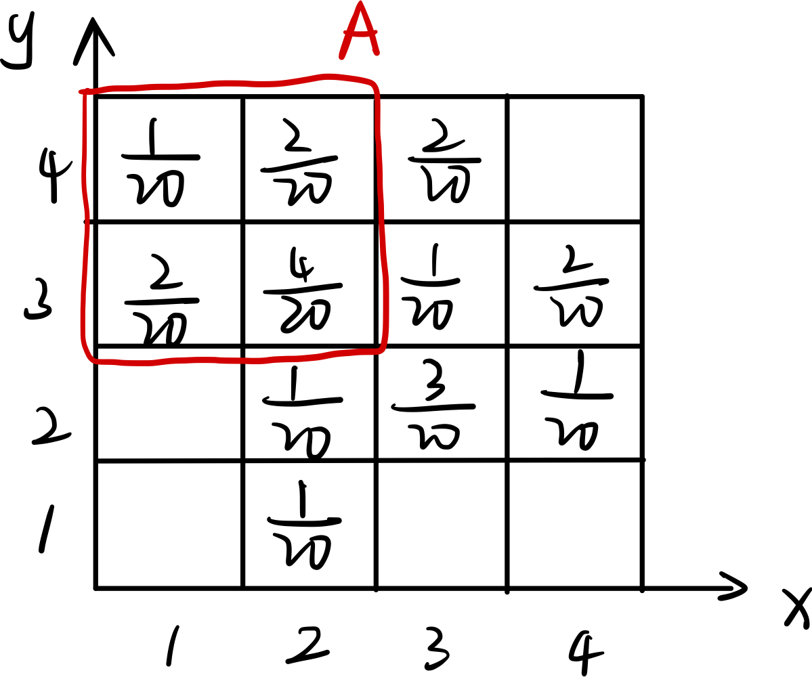

> 什么是随机变量：
>
> - 随机变量是从「样本空间 $\Omega$ 」到「实数空间 $R$」 的一个「映射」。
> - 随机变量是一个变量，变量意味着它有很多的可能取值。随机给出了每种取值出现的概率。
>
> 什么是随机变量的期望：
>
> - 期望可以理解为随机变量的平均值，随机变量的概率是「权重」
> - 随机变量的所有取值，乘以这个值出现的概率，再累加起来。

[toc]

### 离散随机变量

#### 1、离散随机变量

离散随机变量的例子：

> 有这样的试验：从班级中选择一个学生，测量他的身高，记为 $H$ ，那么 $H$ 就是一个「随机变量」。

随机变量是一种映射，如图所示：

其中：

- $X$ 是一个函数，从样本空间到实数集合：$X:\ \Omega \to R$ 
- $x$ 是一个变量：$x \in R$ 

#### 2、一个试验可以有多个随机变量

对于以下的试验：

> 投掷一个均匀的正四面体骰子，随机变量的设置如下：
>
> - $F$ 表示第一次投掷的结果
> - $S$ 表示第二次投掷的结果
> - $X=\min(F, S)$ 

这样一个试验就有三个对应的随机变量。

#### 3、PMF 的定义

PMF：probability mass function

PMF 表示随机变量对应的「样本点」的概率：
$$
\begin{array}{rl}
	P_X(x) & = P(X = x) \\
	       & = P(\{ \omega \in \Omega, \; X(\omega) = x \})
\end{array}
$$
如下图所示：

#### 4、联合 PMF 和边缘 PMF

联合 PMF 的定义如下：
$$
P_{X,\ Y}(x,\ y) = P(X =x,\ Y=y)
$$

边缘 PMF 的定义如下：
$$
P_X(x) = \sum_y P_{X,\ Y}(x, y)
$$

可以基于联合 PMF 来定义条件概率：
$$
P_{X|Y}(x|y) = P(X=x | Y=y) = \frac{P_{X,\ Y}(x,\ y)}{P_Y(y)}
$$

### 离散随机变量的独立性

概率有乘法法则：事件 A 和事件 B 同时发生的概率为：
$$
P(A \cap B) = P(A) \cdot P(B|A)
$$
使用随机变量来表示，可以得到：
$$
p_{X,\ Y}(x,\ y) = p_X(x) \cdot p_{Y|X}(y|x)
$$
如果随机变量 $X,\ Y$ 相互独立，那么可以有以下的表达式：
$$
\color{red} p_{X,\ Y}(x,\ y) = p_X(x) \cdot p_Y(y)
$$
如果独立，那么条件概率就会转化为无条件概率：
$$
p_{X|Y}(x|y) = p_X(x)
$$

> ==如何理解随机变量之间独立：如果知道了 $X$ 的情况，无法推断出任何 $Y$ 的信息，那么两个随机变量就是独立的。== 

> 【例子】原本不独立的随机变量，在某些条件下，可以是独立的
>
> 随机变量 $X,\ Y$ 如下表所示：
>
> 
>
> 随机变量 $X,\ Y$ 是不独立的，因为 $p_{X,\ Y}(2,\ 3) \ne p_X(2) \cdot p_Y(3)$ 
>
> 如果已知事件 $A$ 发生，那么随机变量新的分布如下：
>
> 
>
> 此时，随机变量 $X,\ Y$ 是相互独立的。

