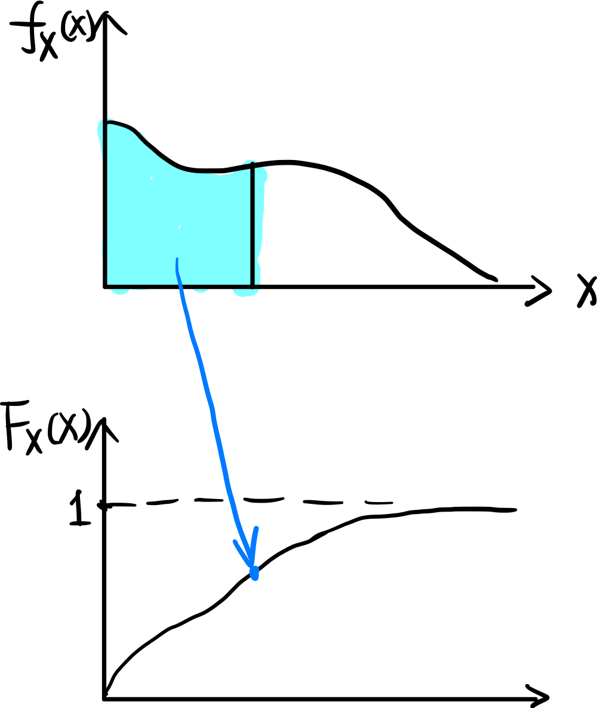
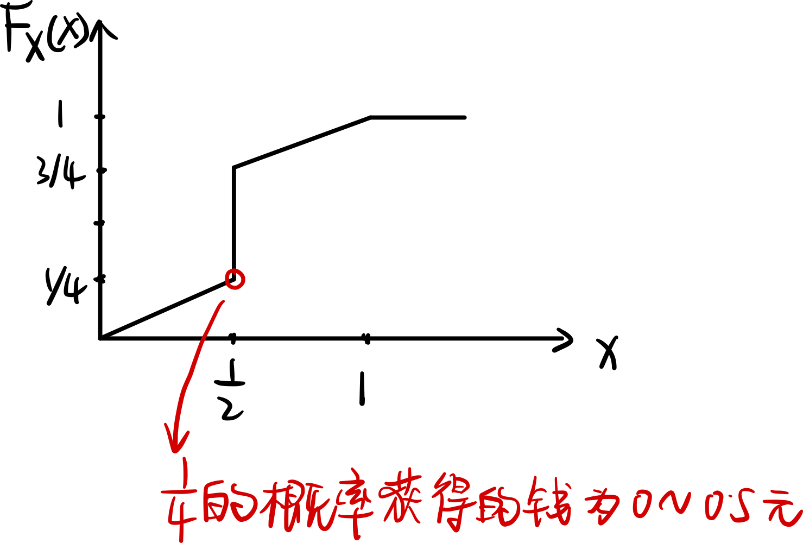
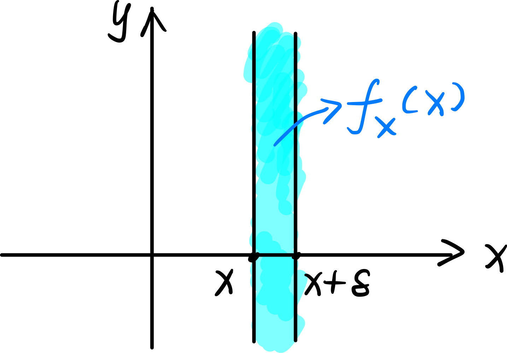
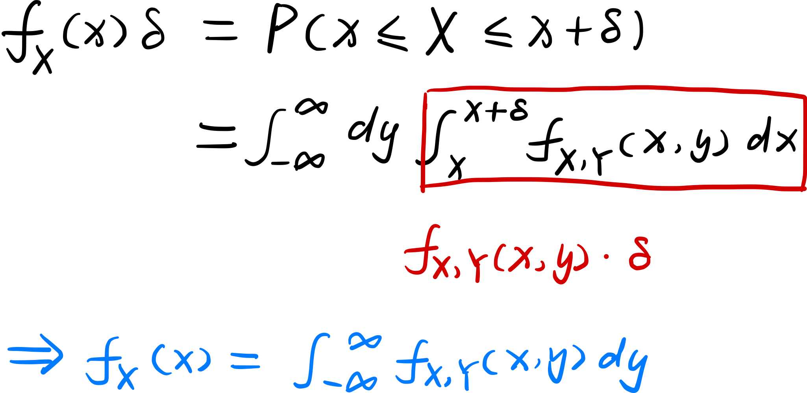
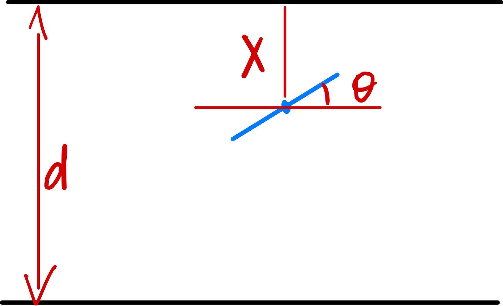
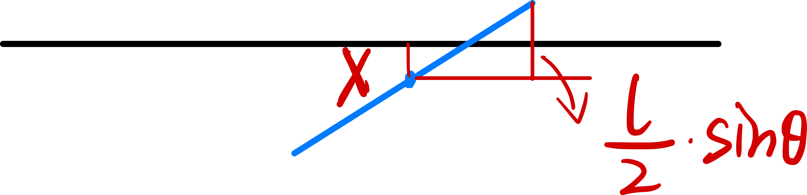
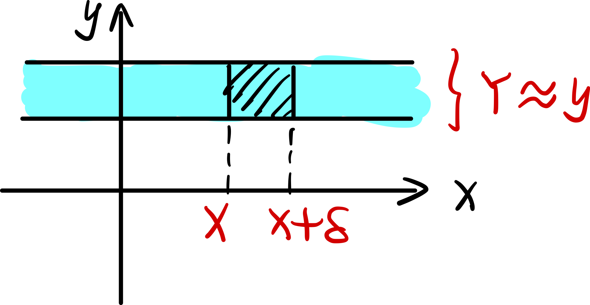
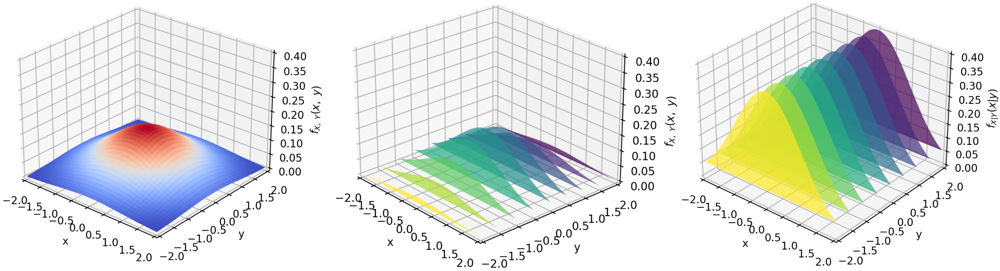

> 如何理解「连续随机变量」：
>
> - 随机变量是样本空间到实数空间的映射，连续意味着随机变量的取值是连续的，因此，只能够衡量随机变量取值位于某个区间的概率。
>
> 如何理解「概率密度函数 PDF」：
>
> - 将概率类比为「质量」。离散随机变量时，质量只分布在某几个点上；连续随机变量时，概率连续地分布在一条线上，因此需要用「密度」来描述质量分布。
>
> 什么是累积分布函数：
>
> - 核心就是：$P(X \le x)$，随机变量小于某个数值的概率。

[toc] 

### 连续随机变量

再提一次，**随机变量是样本空间的函数**。

#### 1、概率密度函数

衡量连续随机变量取值概率的函数是「概率密度函数 probability density function」$f_X(x)$：

> 「**概率密度函数 PDF**」和「**概率质量函数 PMF**」的比较：
>
> - 如果随机变量的取值是离散的，每个随机变量都有某个概率，因此离散随机变量可以用 PMF 来衡量。
>
> - 如果随机变量的取值是连续的，只能给出某个取值区间的概率，这个时候适合用密度来衡量。

#### 3、期望

直接根据定义可以得到：
$$
E[X] = \int_{-\infty}^{\infty} x\ f_X(x)\ dx
$$
其中，$f_X(x)\ dx$ 可以理解为随机变量 $X$ 位于区间 $[x,\ x+dx]$ 上的概率。

随机变量函数的期望为：
$$
E[g(X)] = \int_{-\infty}^{\infty} g(x)\ f_X(x)\ dx
$$

#### 3、方差

根据定义可以得到：
$$
var(X) = \int_{-\infty}^{\infty}(x-E[X])^2\ f_X(x)\ dx
$$

### 累积分布函数

CDF（cumulative distribution function）定义如下：
$$
F_X(x) = P(X \le x)
$$
连续随机变量和离散随机变量都有 CDF。

离散随机变量的 CDF：
$$
F_X(x) = \sum_{k \le x}k\ p_X(k)
$$

连续随机变量的 CDF：

$$
F_X(x) =  \int_{-\infty}^x t\ f_X(t)\ dt
$$

### 混合随机变量

有这样一个事件：

> 有 $\frac{1}{2}$ 的概率可以获得 $0.5$ 元，还有 $\frac{1}{2}$ 的概率获得 $0\sim 1$ 元。将最终获得的钱记为 $X$ 

这里的随机变量既不是离散的，也不是连续的，而是混合的。

其「累积分布函数」如图：

### 均匀分布

均匀分布随机变量是指这样的「连续随机变量」，其概率密度函数如下所示：

$$
f_X(x) = \frac{1}{b-a}
$$
**「均匀分布随机变量」意味着什么**：

任意两个等长区间的概率是相等的，这意味着完全随机。

期望：（可以从重心的角度直接得出）
$$
E[X] = \frac{a+b}{2}
$$
方差：
$$
var(X) = \frac{(b-a)^2}{12}
$$

### 正态分布

#### 1、正态分布

符合标准正态分布的随机变量记为 $X\sim N(0,\ 1)$，其概率密度函数为：
$$
f_X(x) = \frac{1}{\sqrt{2\pi}}e^{-x^2/2}
$$
图像为：

期望和方差是：
$$
E[X] = 0,\quad var(X) = 1
$$

#### 2、正态分布变量的线性函数

==正态分布随机随机变量的线性函数，也是正态分布的随机变量==，例如：

$X$ 是正态分布的随机变量 $X\sim N(\mu,\ \sigma^2)$，$Y = aX + b$，则有：
$$
E[Y] = aE[X] + b,
\quad
var(Y) = a^2 var(X)
$$
因此，$Y\sim N(a\mu + b,\ a^2 \sigma^2)$ 。

#### 3、查标准正态分布表

标准正态分布表就是 $N(0,\; 1)$ 的「累积分布函数 CDF」的函数表。

对于任意的正态分布随机变量 $X\sim N(\mu,\; \sigma^2)$，如果想要知道它的某个「CDF」的值，可以这样做：
$$
\begin{array}{rl}
	F_X(k) & = P(X \le k) \\
	       & = P(\frac{X - \mu}{\sigma} \le \frac{k-\mu}{\sigma}) \\
	       & = F_N(\frac{k-\mu}{\sigma})
\end{array}
$$
其中：

- $F_N(x)$ 是标准正态分布的累积分布函数。
- 因为任意正态分布随机变量可以通过 $\frac{X-\mu}{\sigma}\sim N(0, 1)$ 来进行标准化，所以才有上述表达式。

简而言之：任意正态分布随机变量的累积分布函数 $F_X(x)$ 与标准正态分布的累积分布函数之间的关系：
$$
F_X(x) = F_N(\frac{x-\mu}{\sigma})
$$

### 联合概率密度函数

#### 1、联合概率密度

如何理解「联合概率密度函数」：用「线密度」来类比「概率密度函数」，那么就用「面密度」来类比「联合概率密度函数」。
$$
P(x \le X + \delta,\ y \le Y \le y + \delta) \approx f_{X,\ Y}(x,\ y) \delta^2
$$

#### 2、边缘概率密度

通过「联合概率密度」计算「边缘概率密度函数」，示意图为：

计算公式为：

#### 3、多个随机变量函数的期望

根据定义来计算：
$$
E[g(X,\ Y)] = \int_{-\infty}^{\infty}\int_{-\infty}^{\infty}g(x,\ y)\ f_{X,\ Y}(x,\ y)\ dxdy
$$
对比离散的多个随机变量函数的期望：
$$
E[g(X,\ Y)] = \sum_x \sum_y p_{X,\ Y}(x, y)
$$

#### 4、多个连续随机变量的独立性

两个连续随机变量独立，则有：
$$
f_{X,\ Y}(x,\ y) = f_X(x) \cdot f_Y(y)
$$

### Buffen 投针试验

问题背景：

>区域内有两条平行直线，随机向区域内投针，求针与直线相交的概率。

首先确定这个模型，决定出样本空间：

- 针的中心位置到最近的线的距离是 $X$ 
- 针的角度记为 $\Theta$ 
- 随机变量的取值范围是：$X\in [0,\ d/2]$，$\Theta \in [0,\ \pi/2]$ 

根据直觉，两个随机变量都是均匀分布的，且两个随机变量是独立的，因此：
$$
f_{X,\ \Theta}(x,\ \theta) = f_X(x) \cdot f_\Theta(\theta) = \frac{2}{d} \cdot \frac{2}{\pi}
$$
针与线相交这个事件如何用随机变量描述：

$$
P(A) = P(X \le \frac{l}{2}\sin \Theta)
$$
计算这个事件的概率：
$$
P(X\le \frac{l}{2}\sin\Theta) = \iint_{x\le \frac{l}{2}\sin\theta} f_{X,\ \Theta}(x,\ \theta)\ dxd\theta = \frac{2l}{\pi d}
$$

### 条件概率密度

如何理解条件概率密度：

$$
P(x\le X \le x + \delta\ |\ Y \approx y)\approx f_{X|Y}(x|y)\cdot \delta \\
\Rightarrow f_{X|Y}(x|y) = \frac{f_{X,\ Y}(x,\ y)}{f_Y(y)}
$$

联合概率密度，边缘概率密度，条件概率密度的示意图：

$$
f_{X,\ Y}(x,\ y) = \frac{1}{2\pi}e^{-\frac{1}{2}(x^2 + y^2)}
$$

- 第一张图是联合概率密度的示意图
- 第二张图每个切片的面积表示边缘概率密度：$f_Y(y)$ 
- 第三张图对切片面积进行「归一化」，得到的图形就是条件概率密度：$f_{X|Y}(x|y)$ 。可以看出，每个条件概率密度都是一样的，因此两个随机变量 $X,\ Y$ 是独立的。

