> 连续随机变量函数的分布：先算出累积分布函数，再求导得到概率密度函数。

[toc]

### 单个随机变量的函数

有个两个随机变量 $X,\ Y$，两者的关系是 $Y = g(X)$，已知 $X$ 的分布，如何得到 $Y$ 的分布。

#### 1、离散情形

已知离散随机变量的分布，计算其函数的分布。

示意图如下：

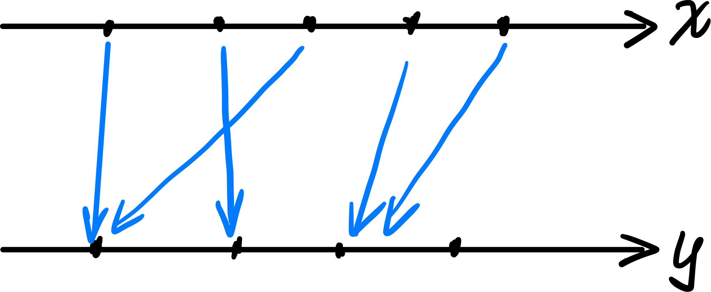

概率质量函数如下：
$$
\begin{array}{rl}
	p_Y(y) & = P(g(Y) = y) \\
	       & = \sum_{x:\ g(x) = y} p_X(x)
\end{array}
$$

#### 2、连续情形

使用累积分布函数计算要方便一些：
$$
\begin{array}{rl}
	F_Y(y) & = P(Y \le y) \\
	       & = P(g(X) \le Y)
\end{array}
$$

求导即可得到概率密度函数。

#### 3、例子

路程为 200，速度的分布已知，求时间 T 的分布。

直接计算：
$$
\begin{array}{rl}
	F_T(t) & = P(T \le t) \\
	       & = P(V \ge \frac{200}{t}) \\ 
	       & = 2 - \frac{20}{3t}
\end{array}
$$
求导可得随机变量 $T$ 的概率密度函数：
$$
f_T(t) = \frac{20}{3t^2}
$$
也就是：

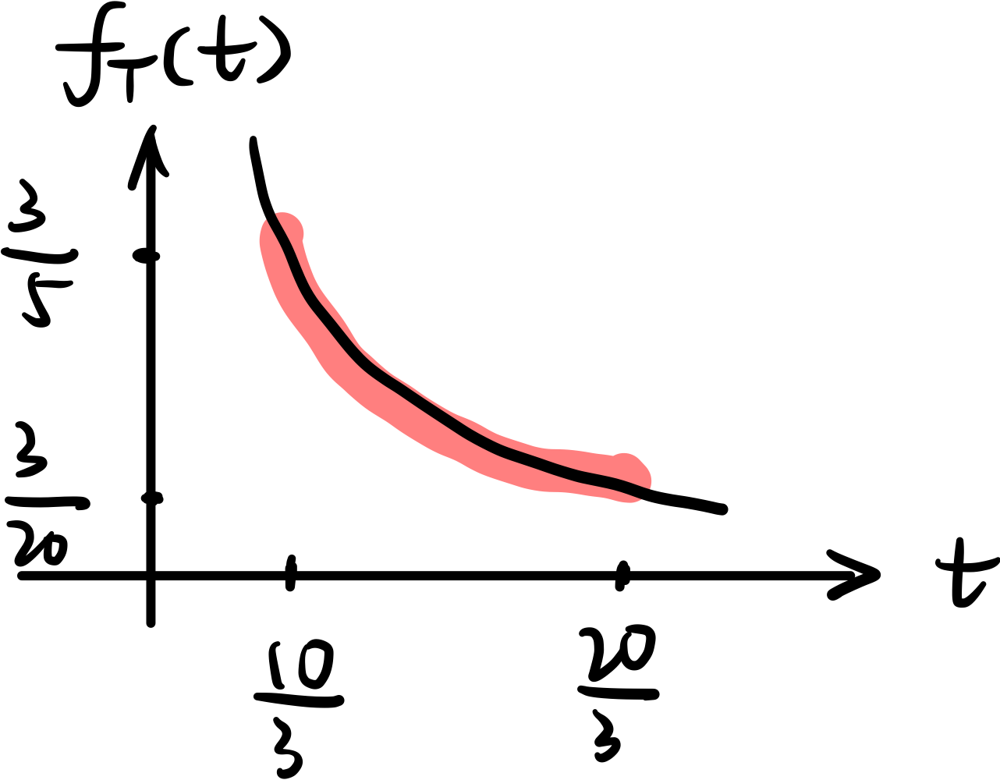

如何理解这个图呢：同样的 $\delta V$，在 $V$ 较小时对应的 $\delta T$ 较大，因此才有这个现象。

### 随机变量的单调函数

对于随机变量 $X$ 的任意函数 $Y=g(X)$，只要函数是单调的，那么可以进行如下推导：

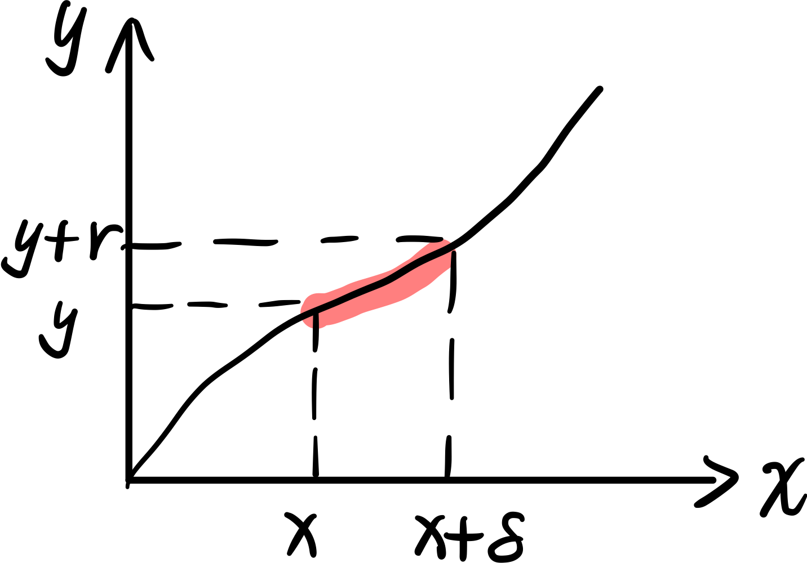

随机变量 $X$ 在区间 $(x,\ x+\delta)$ 的概率，等于随机变量 $Y$ 位于区间 $(y,\ y+\gamma)$ 的概率。

当 $\delta\to 0$ 时，有：
$$
P(x\le X\le x + \delta) = f_X(x) \cdot \delta \\ 
P(y\le Y \le y + \gamma) = f_Y(y) \cdot \gamma \\ 
\gamma = g'(x) \cdot \delta
$$
因此，只要知道了 $X$ 的概率密度函数，$Y$ 的概率密度函数就很容易得到：
$$
f_Y(y) = \frac{f_X(x)}{|g'(x)|}
$$
注：如果想要去掉表达式中的 $x$，使用 $x=g^{-1}(y)$ 替换即可。

### 两个随机变量的商

已知随机变量 $X,\ Y$ 的分布，求 $Z=Y/X$ 的分布。

联合概率密度为：

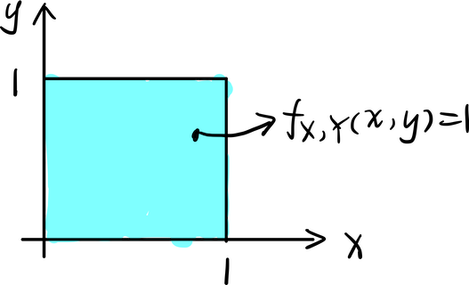

首先计算 $Z$ 的累积分布函数：
$$
F_Z(z) = P(Z \le z) = P(Y \le z X)
$$
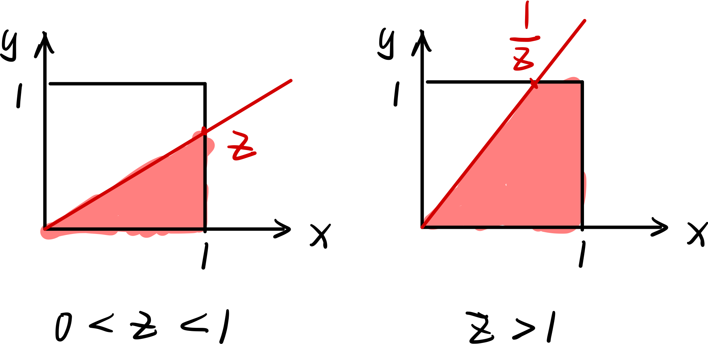

得到的 CDF 如下图所示：

概率密度函数如下图：

由于 $X,\ Y$ 是相互独立的，因此可以用一下方法来计算期望：
$$
E[X/Y] = E[X] \cdot E[\frac{1}{Y}] = +\infty
$$

### 两个随机变量之和

已知 $X,\ Y$ 的分布，且两随机变量独立，要求 $W = X+Y$ 的分布。

#### 1、离散情形

随机变量 $W$ 的概率质量函数 PMF 为：
$$
p_W(w) = \sum_x p_X(x) \cdot p_Y(w-x)
$$
这实际上是在做函数 $p_X(x)$ 和 $p_Y(y)$ 的离散卷积[^1]。

如何计算这个表达式，如果随机变量 $X,\ Y$ 的概率质量函数如下所示：

卷积的计算方式为：将 $p_Y(y)$ 沿 $y$ 轴翻折，然后移动 $w$ 的距离，对应位置相乘，结果相加：

$p_W(w=0) = 0$：

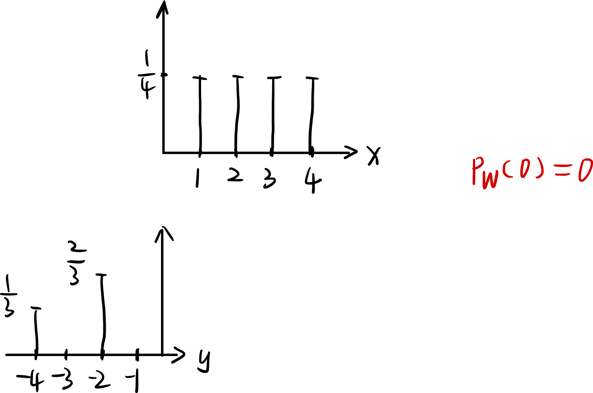

$p_W(w=3) = 1/6$，可以理解为：当 $X=1$，且 $Y=2$ 时，可以得到 $W=3$：

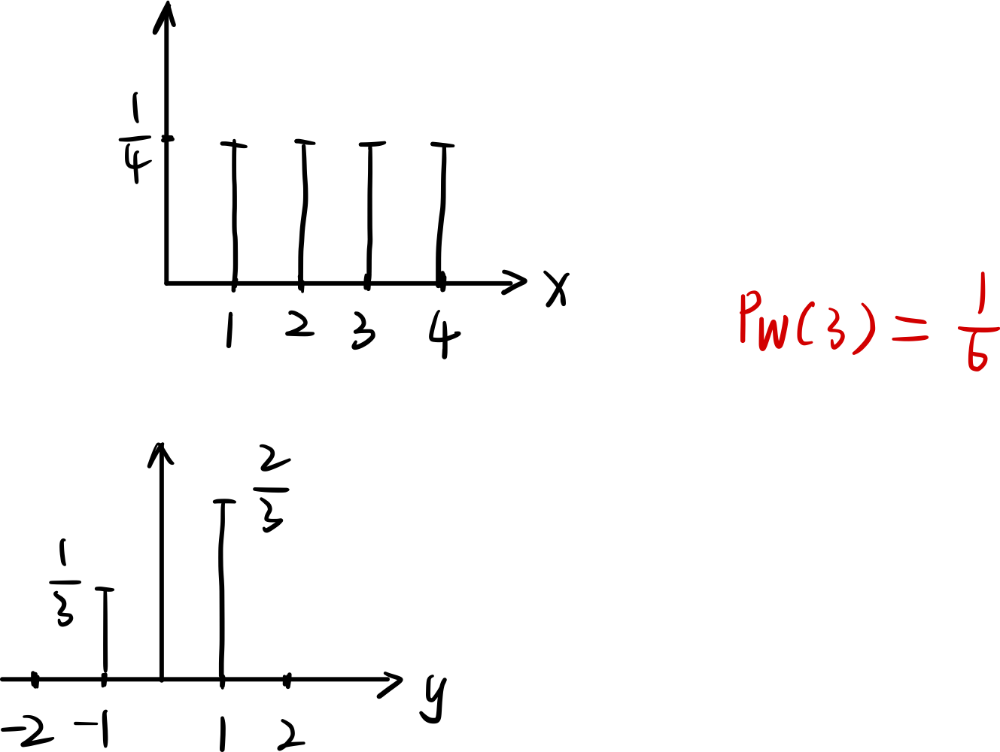

$p_W(w=5) = 1/4$，意味着：当 $X=1,\ Y=4$ 或者 $X=3,\ Y=2$ 这两种情形时，可以有 $W = 5$，出现的概率是 $1/4$：

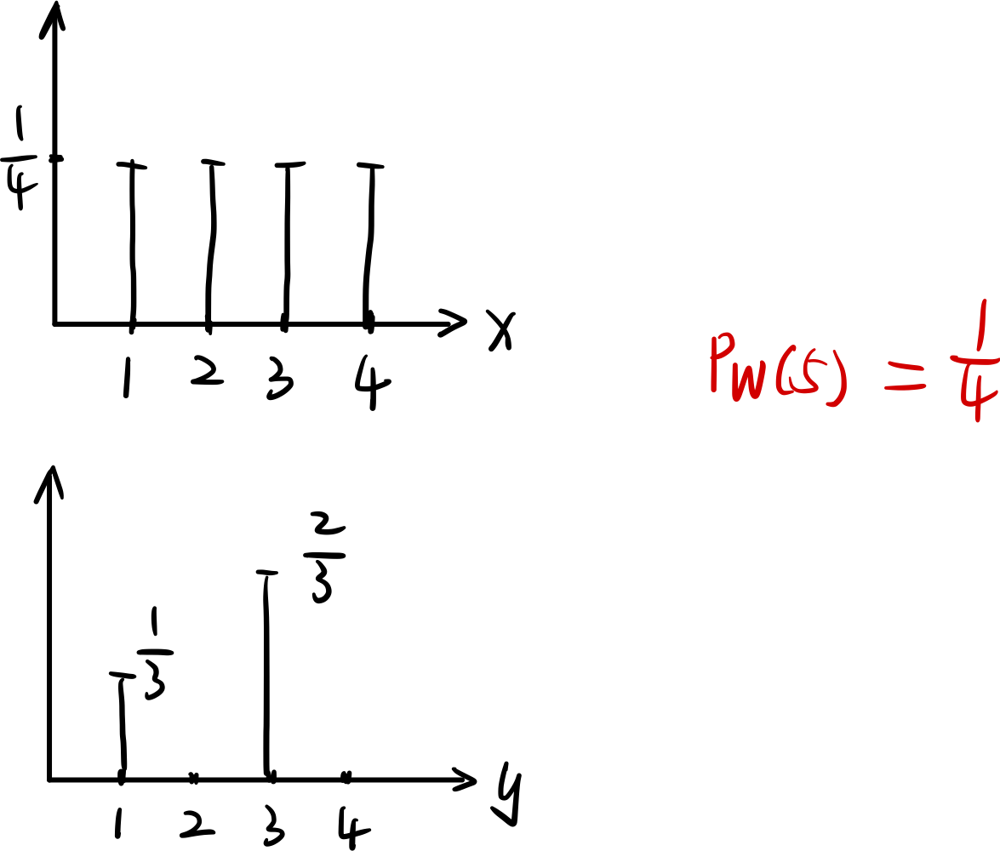

#### 2、连续的情形

随机变量 $W$ 的概率密度函数为：
$$
f_W(w) = \int_{-\infty}^{+\infty} f_X(x)\ f_Y(w-x) dx
$$
这就是函数 $f_X(x)$ 和 $f_Y(y)$ 的卷积。

给定了某个 $W=w_i$，相当于在下图所示的直线区域上进行积分（**第二类曲线积分**）：

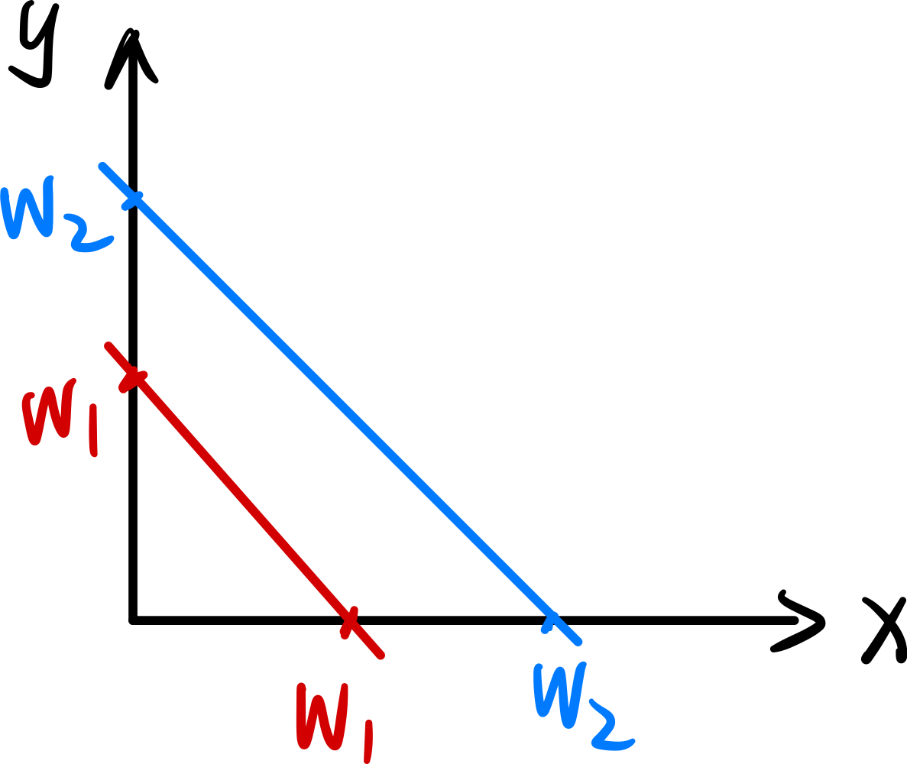

积分区域是直线 $y = w_i - x$，被积函数是 $f_X(x) \cdot f_Y(y)$，积分的结果为：
$$
\int_{l}f_X(x) \cdot f_Y(y) dx = \int_{-\infty}^{+\infty}f_X(x) \cdot f_Y(w_i - x) dx
$$

### 独立正态随机变量

有两个独立的正态分布随机变量：
$$
X\sim N(\mu_x, \ \sigma_x{}^2) \quad
Y\sim N(\mu_y, \ \sigma_y{}^2)
$$
其联合概率密度为：
$$
f_{X,\ Y}(x,\ y) = \frac{1}{2\pi \sigma_x \sigma_y} 
\exp \left\{
	-\frac{(x-\mu_x)^2}{2\sigma_x{}^2}
	-\frac{(y-\mu_y)^2}{2\sigma_y{}^2}
\right\}
$$
这个图形是一个钟形，每个截面都是椭圆，椭圆中心是 $(\mu_x,\ \mu_y)$：

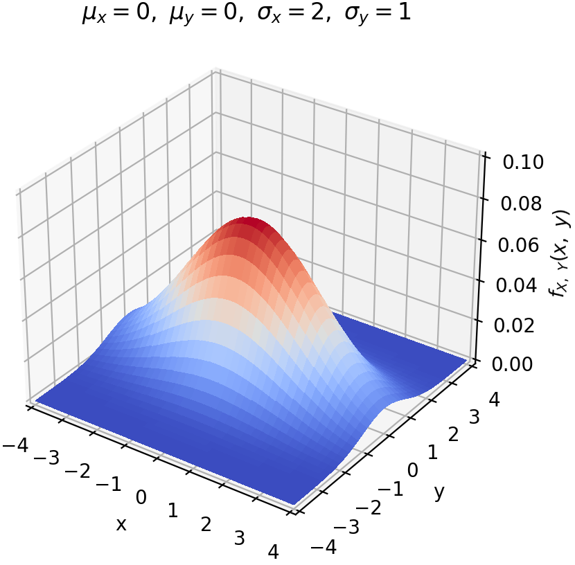

独立正态随机变量的和也是正态随机变量（不证明），即：
$$
X+Y \sim N(\mu_x + \mu_y,\ \sigma_x{}^2 + \sigma_y{}^2)
$$

### 折断棍子构成三角形

一个棍子随机折断为3段，可以构成三角形的概率。

> 棍子上的两个折断点是均匀分布的 $U(0,\ l)$，且相互独立。

记折断点位于中点两侧为事件 $A$，很容易知道 $P(A)=1/2$。

**在此基础上**，将两个折断点到端点的距离记为 $X,\ Y$：

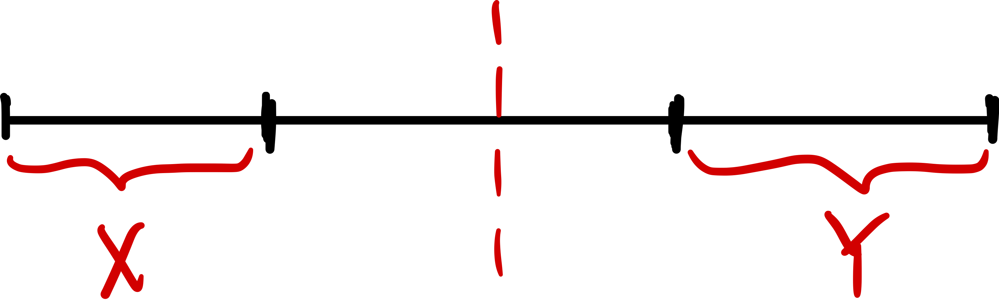

构成三角形的充要条件是：中间那段的长度小于 $l/2$，既：$X+ Y > l/2$。 

由于 $X,\ Y \sim U(0,\ l/2)$，且两个随机变量相互独立，因此构成三角形对应的概率为：

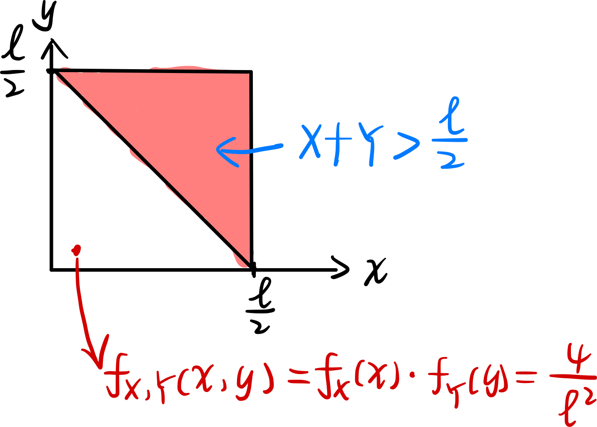
$$
P(X+Y>\frac{l}{2}) = \frac{1}{2}
$$
因此，随机折断棍子构成三角形的概率为 $1/4$。

### Ref

[^1]: 离散卷积

$$
(f * g)(x) = \sum_{\tau}f(\tau) \ g(x - \tau)
$$

