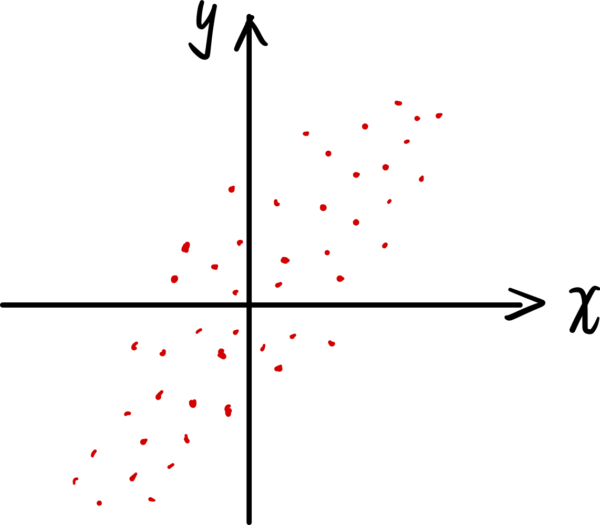

> 如果两个随机变量独立，则有 $cov(X,\ Y) =0 $；反之则没有。

[toc]

#### 相关性的直观理解

某个样本空间呈现如下的情形，其中 $X,\ Y$ 是随机变量： 

如果已知某个样本点的 $X$ 很大，那么它的 $Y$ 应该也会很大，两个随机变量之间存在着相关性。

#### 协方差

协方差可以捕捉随机变量之间的相关性：
$$
cov(X,\ Y) = E[(X-E[X]) \cdot (Y-E[Y])]
$$

#### 协方差的性质

随机变量与自身的协方差，退化为方差：
$$
cov(X,\ X) = var(X)
$$
计算协方差的快捷方式：
$$
cov(X,\ Y) = E[XY] - E[X] \cdot E[Y]
$$
协方差和方差的一个推论：

#### 协方差系数

协方差系数是对协方差的归一化，是一个无量纲的数：
$$
\rho = E\left[
	\frac{X-E[X]}{\sigma_x} \cdot
	\frac{Y-E[Y]}{\sigma_y}
\right]
$$
其中，$\sigma_x$ 是标准差。

协方差系数的取值范围是 $[-1,\; 1]$ 

- 当 $|\rho|=1$，意味着两个随机变量线性相关。
- $\rho=0$ 意味着没有系统性的关系。