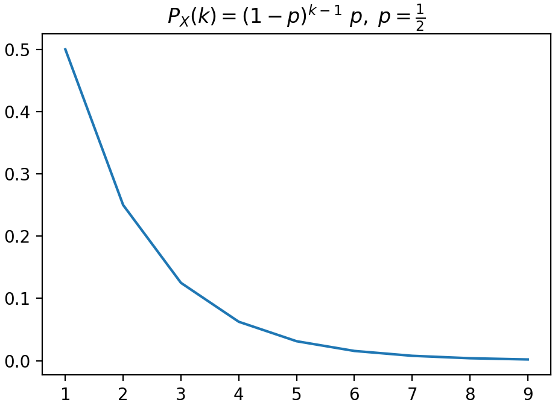
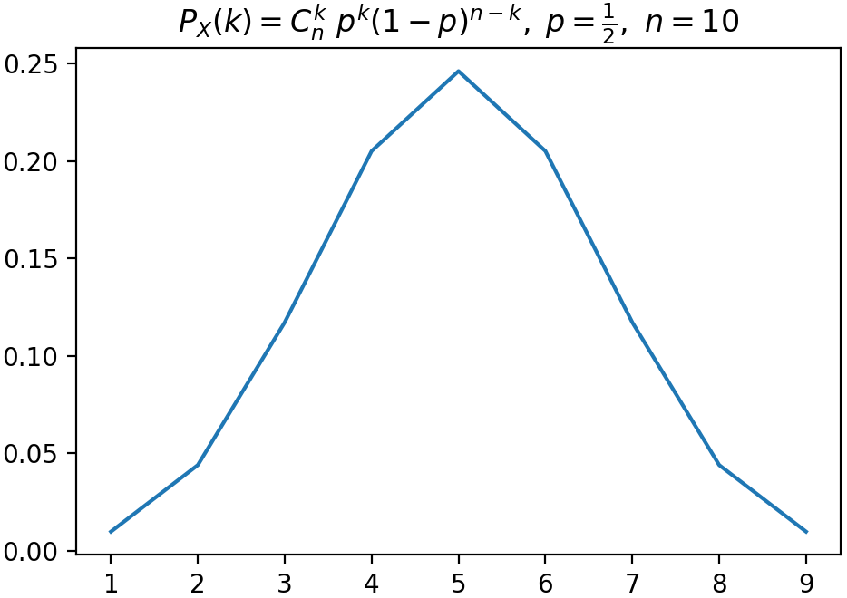

> TODO：伯努利过程的初次是几何分布，k 次是伯努利分布，k 次的时间是帕斯卡分布

[toc]

#### 1、几何分布随机变量

这样一个试验：

> 投掷硬币，直到得到正面才停止，将投掷次数记为 $X$ 
>
> 则有：
> $$
> \begin{array}{rcl}
> 	投掷情形 && 随机变量取值 \\
> 	H && X = 1 \\
> 	TH && X = 2 \\ 
> 	\underbrace{T\cdots T}_{k-1}H && X = k
> \end{array}
> $$

上述随机变量的 PMF 可以写为：
$$
p_X(k) = (1-p)^{k-1} p
$$
其中，$p$ 表示硬币正面的概率。

这是一个「几何 PMF」，与「几何级数」有关。

图像为：

#### 2、二项分布随机变量

有这样一个试验：

> 投掷硬币，设 $n$ 为总的投掷次数，$k$ 表示正面朝上的次数，记为 $X$ 。

随机变量 $X$ 的 PMF 为：
$$
P_X(k) = C_n^k \ p^k \ (1-p)^{n-k}
$$
其中，$p$  是一次投掷正面朝上的概率。

这个 PMF 的图像为：

